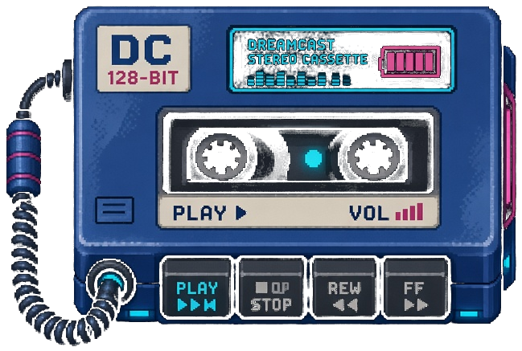

# 128bit Music



Your listening, gamified. Spotify + Apple Music stats, streaks, playlist
quests, and discovery — with XP flowing into 128bitlife.
Part of the 128bit family.

> Product direction is Daniel's call — this README is a starter brief so
> Carlos (Claude Code) has something concrete to react to. The landing page
> is live. The Android app (below) started as a pixel-art fork of Echo Music.

## The Android app (`android/`)

`android/` is **128bit Music for Android**, a pixel-art version of our friends' app
[Echo Music](https://github.com/EchoMusicApp/Echo-Music). It keeps YouTube Music sign-in,
streaming, downloads, playlists and lyrics, and real cover art, and adds 128bit palettes,
pixel corners, pixel fonts, a block seek bar and a pixelated player background. Echo's code
is GPL-3.0, so `android/` is GPL-3.0 too.

- What changed and how to build: [`android/128BIT.md`](android/128BIT.md)
- Get the APK: **Actions** tab → latest "Build 128bit Music APK" run → download the artifact
- Original plan and mockup: [`PIXELFY.md`](PIXELFY.md), [`mockups/echo-128bit.html`](mockups/echo-128bit.html)

## Provider API status (researched 2026-10-04)

| Provider | API | Auth | Difficulty |
|---|---|---|---|
| **Spotify** | ✅ Official Web API (`https://api.spotify.com/v1`) | OAuth 2.0 (3-legged), app registration at `developer.spotify.com` | Easy-medium. Auth is standard OAuth; rich endpoints (top tracks/artists, recently played, playlists, audio features). Start here. |
| **Apple Music** | ✅ Official MusicKit API | MusicKit JS + developer token (JWT, ES256) + user token | Medium. Developer token plumbing is fiddly; catalog + library access is solid once set up. |
| **YouTube Music** | ❌ No official public API | Unofficial libs (session scraping) | Hard/fragile. Build last, if ever — same quarantine rule as Fantrax. |

Key Spotify endpoints: `GET /me/top/{tracks,artists}`, `/me/player/recently-played`,
`/me/playlists`, `/playlists/{id}/tracks`, `/audio-features` (where available),
`/recommendations` (seed-based discovery).

## Architecture — providers fetch, app normalizes

```
src/
  providers/
    spotify/     # OAuth 2.0 client + token refresh. Start here.
    applemusic/  # MusicKit JS + developer token. Second.
    ytmusic/     # Unofficial. Quarantined: expect breakage. Last, if ever.
  listening/
    stats/       # Normalized Track, Artist, PlayEvent models + aggregation
                 # (top artists, streaks, genre breakdown) across providers.
  quests/        # Playlist quests + discovery missions.
  events.ts      # 128bit shared event schema — emit track.played,
                 # playlist.created, streak.milestone, discovery.saved, etc.
                 # 128bitlife subscribes to the feed for quests + XP.
```

Rules:
- **Providers fetch. Listening normalizes.** No provider-specific shapes leak past `listening/`.
- One unified view: a track is a track no matter which service it came from.
- Never store raw credentials in the repo. OAuth tokens / developer keys live in env or secure storage.
- Respect provider ToS: cache aggressively, don't poll recently-played more often than needed.

## Start-here brief for Claude

```
We're building 128bit Music — gamified listening companion (Spotify first,
Apple Music second), part of the 128bit family. Read this README first.

Build order:
1. src/providers/spotify/ — OAuth 2.0 flow + token refresh, then reads:
   /me/top/tracks, /me/top/artists, /me/player/recently-played,
   /me/playlists. Cache top-items daily.
2. src/listening/stats/ — normalized models (Track, Artist, PlayEvent) +
   aggregator: top artists/genres, listening streaks, "wrapped all year"
   rollups across providers.
3. UI: pick the stack (Expo to match the 128bit family, or web-first — ask Daniel).
   Tabs: Stats, Quests, Discover, Playlists.
4. src/quests/ — quest engine: "build a 90s road-trip mix", "find 5 new
   artists this week", streak missions. Completions emit 128bit events.
5. src/providers/applemusic/ — MusicKit JS integration, developer token
   plumbing, catalog + library reads.
6. src/providers/ytmusic/ — LAST, if ever. Unofficial, fragile.

Constraints: providers fetch, listening normalizes. Emit 128bit events (see
events.ts once created) for plays, playlists, streaks, discoveries. Small
commits, one provider per commit. Never commit credentials.
```

## 128bit tie-in

Music is a first-class 128bit citizen: `track.played` streaks, `playlist.created`
quests, and `discovery.saved` wins become events in the shared feed, so
128bitlife can issue quests ("discover 3 new artists") and XP. Don't silo the data.

## Monetization (family default)

128bit Pro bundle covers Music. No per-app paywall at launch; listening stats
and quests are core. Cosmetic IAPs (profile themes, badges) live here later,
same as the rest of the family.
